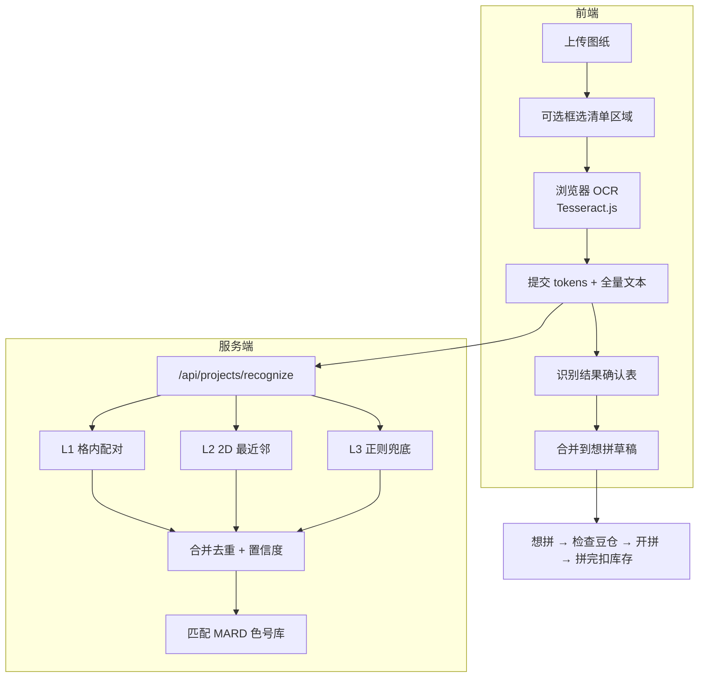

# 二期技术设计 · 图纸材料识别

> 版本：0.1 · 状态：实现中  
> 关联页面：`/wish` · 关联模块：`src/lib/recognize-material.ts`

## 1. 目标

从拼豆图纸（材料清单区域）自动识别 **色号 + 数量**，汇入「想拼」流程，经用户确认后进入库存检查与开拼。

支持数量相对色号的多种方位：

```
左:  320  A1          右:  A1  320          下:  A1
                                              320
```

## 2. 整体架构



## 3. 分层识别策略

| 层级 | 名称 | 适用场景 | 实现 |
|------|------|----------|------|
| **L1** | 格内配对 | 网格图例，色号在上、数量在下 | 坐标聚类 → 簇内一对一配对 |
| **L2** | 2D 最近邻 | 自由列表，左/右/上/下 | 色号找最近未占用数字 |
| **L3** | 正则兜底 | OCR 连读 `A1 320` | `parseMaterialListText` |
| **L4** | 人工确认 | 全部 | 前端可编辑表格，必做 |

优先级：**L1 > L2 > L3**，同色号取置信度最高结果。

## 4. 数据结构

### OCR Token（前端 Tesseract 输出）

```typescript
type OcrToken = {
  text: string;
  bbox: { x0: number; y0: number; x1: number; y1: number };
};
```

### 识别结果

```typescript
type LayoutDirection = "left" | "right" | "above" | "below";

type RecognizedPair = {
  code: string;           // A1
  quantity: number;       // 320
  layout: LayoutDirection;
  confidence: number;     // 0~1
  method: "grid" | "spatial" | "regex";
};
```

### API

```
POST /api/projects/recognize
Body: { tokens?: OcrToken[]; text?: string }
Response: {
  pairs: (RecognizedPair & { colorId?: string; hex?: string })[];
  unknown: string[];
  rawText: string;
}
```

## 5. 核心算法

### 5.1 分类

```typescript
// 色号：MARD 格式 字母+数字
/^[A-Z]+\d+$/i  →  A1, B12, T1, ZG3

// 数量：纯数字，过滤异常
/^\d+$/ 且 1 ≤ n ≤ 50000
```

### 5.2 方位判定

比较色号与数量中心点 `(cx, cy)`：

```typescript
dx = qty.cx - code.cx
dy = qty.cy - code.cy

if (|dx| > |dy|)  →  dx > 0 ? "right" : "left"
else              →  dy > 0 ? "below" : "above"
```

### 5.3 L2 空间配对

```typescript
for each code (按阅读顺序):
  candidates = numbers 未被占用
    .filter(n => distance(code, n) < MAX_DIST)
    .filter(n => yOverlap(code, n) > 0.3 || xOverlap(code, n) > 0.3)

  best = minBy(candidates, n => score(code, n))

score = distance
      - xAlignBonus * 15   // 下方/上方布局 X 对齐
      - belowBonus * 10    // 数量在色号下方
```

`MAX_DIST` 默认按图像对角线 15% 动态计算。

### 5.4 L1 格内配对

1. 对所有 token 做距离聚类（阈值 ≈ 80px，随图像缩放）
2. 簇内仅 1 个色号 + 1 个数字 → 直接配对，`method: "grid"`
3. 簇内多个数字 → 取得分最低（最近）的一个

### 5.5 L3 正则兜底

对 OCR 全文执行 `parseMaterialListText`，补 L1/L2 未覆盖的色号。

### 5.6 合并规则

- 同一色号多条结果 → 保留 **confidence 最高**
- confidence &lt; 0.4 → 标记低置信，前端高亮
- 未在色号库中找到 → 列入 `unknown`

## 6. OCR 方案选型

| 方案 | 一期选用 | 说明 |
|------|----------|------|
| **Tesseract.js（浏览器）** | ✅ 当前 | 零服务端依赖，带 bbox，个人本机够用 |
| PaddleOCR（服务端） | 后续 | 中文准确率更高，需 Python 或独立服务 |
| 视觉大模型 | 远期 | 灵活但成本高 |

**当前 OCR 配置（v0.2）**：
- 语言：`eng`（不用 chi_sim，避免 A1 被识别成乱码）
- 预处理：放大 1.5~3x + 灰度 + 对比度
- 字符白名单：`A-Z 0-9 x : ×`
- 解析：行内配对 → 格内/空间配对 → 全文 regex → 旧版 regex

### 准确率说明

Tesseract 对 **清晰、正拍、字号较大** 的材料清单文字效果尚可；对 **彩色底、小字、艺术字、整图含像素网格** 的图纸准确率很低，**不能替代人工核对**。

若 OCR 原文（「查看 OCR 原文」）已是乱码，图片识别无法救回来，请改用 **粘贴清单文字** 或 **手动添加**。

## 7. 前端交互

1. 上传图纸后显示预览
2. **识别图片清单** 按钮 → 进度条 → 结果表
3. 表格列：色号 · 数量 · 方位 · 置信度 · 删除
4. 低置信度行黄色背景，可 inline 编辑
5. **确认加入清单** → 合并到 draftLines
6. 仍保留：粘贴文字识别、手动添加

### 框选区域（v0.2）

Canvas 拖拽矩形裁剪清单区，仅对裁剪图 OCR，提升准确率。（文档预留，后续迭代）

## 8. 与想拼流程衔接

```
导入图纸
  → 识别/粘贴/手动 → 确认材料表
  → 加入想拼 (POST /api/projects)
  → 选豆仓 → POST /api/projects/:id/check
  → 不够：缺货明细 + 去补库存
  → 够了：POST /api/projects/:id/start → 正在拼
  → POST /api/projects/:id/complete → 扣库存 → 拼完了
```

## 9. 文件清单

| 文件 | 职责 |
|------|------|
| `docs/PHASE2-TECH.md` | 本文档 |
| `src/lib/recognize-material.ts` | L1/L2/L3 识别算法 |
| `src/lib/project.ts` | 文字解析、库存检查 |
| `src/app/api/projects/recognize/route.ts` | 识别 API |
| `src/components/wish/ImageRecognizer.tsx` | OCR + 确认 UI |

## 10. 迭代计划

- [x] 想拼三态工作流
- [x] 文字清单解析
- [x] 识别算法 + API
- [x] Tesseract 浏览器 OCR
- [x] 识别结果确认表
- [ ] 框选清单区域
- [ ] PaddleOCR 服务端可选
- [ ] 图纸来源预设（Pixelbead 等）

## 11. 已知限制

- Tesseract 对小字、艺术字体、斜拍照片准确率有限 → 必须人工确认
- 屏幕色与实物色无关，本模块只读 **文字与数字**
- 网格坐标轴数字（1,2,3…）因不符合色号格式会被自动忽略
